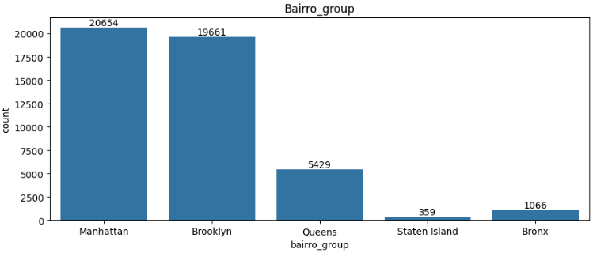
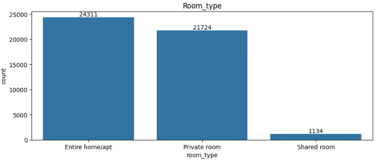
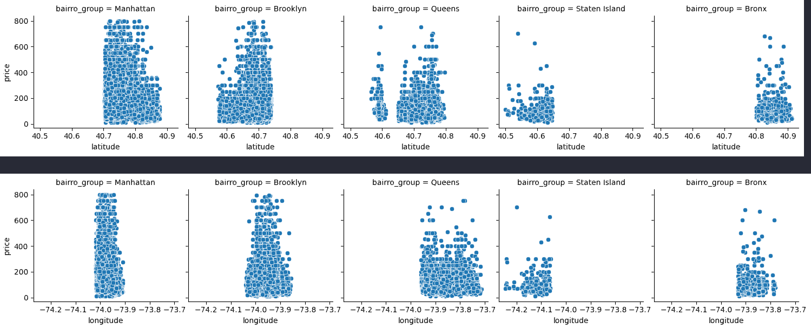
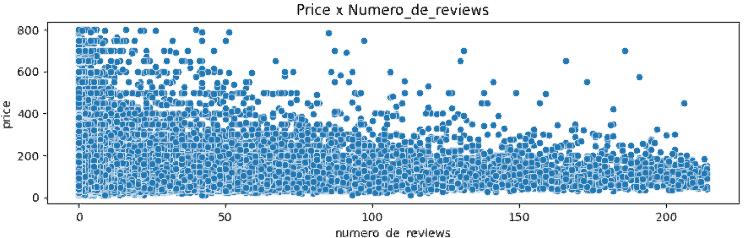
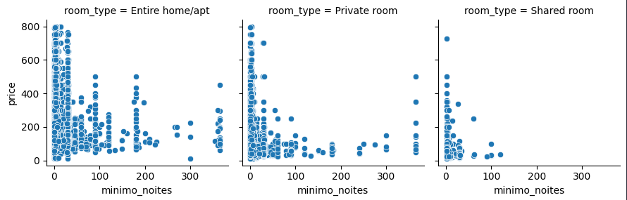
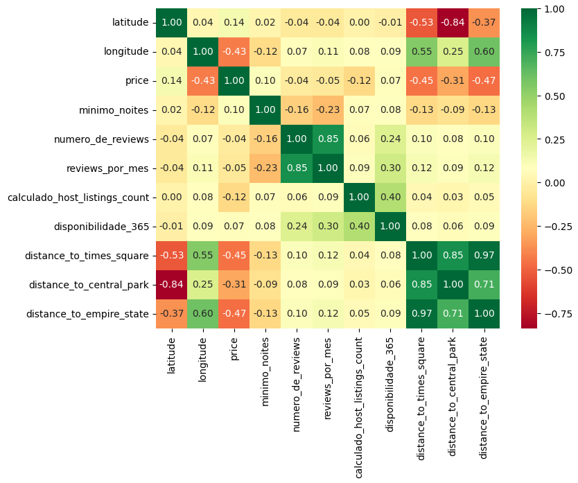
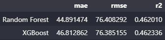
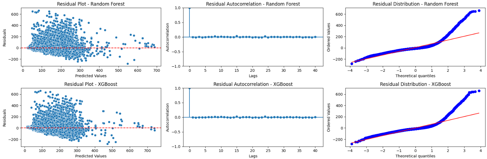

# [Rent Price Prediction](https://rentpriceprediction.azurewebsites.net/)


## Pipeline
The file `ML Pipeline.py` needs to be used in the same directory where the folder `artifacts` is. The script will prompt a file explorer window for the user to choose the dataset, will import the preprocessor and model from the artifacts folder and create a dataset called `results.csv` in this same directory.

## Dataset
The dataset for this project was given by Incidium, and is about advertisements from New York City on a rental platform.
It consists of 48.894 rows with 16 columns:

- **id**: Acts as a unique key for each ad in the app data
- **nome**: Represents the name of the ad
- **host_id**: Represents the id of the user who hosted the ad
- **host_name**: Contains the name of the user who hosted the ad
- **bairro_group**: Contains the name of the area where the ad is located
- **bairro**: Contains the name of the neighborhood where the ad is located
- **latitude**: Contains the latitude of the location
- **longitude** Contains the longitude of the location
- **room_type**: Contains the type of space for each ad
- **price**: Contains the price per night in dollars listed by the host
- **minimo_noites**: Contains the minimum number of nights that the user must book
- **numero_de_reviews**: Contains the number of reviews given to each listing
- **ultima_review**: Contains the date of the last review given to the listing
- **reviews_por_mes**: Contains the number of reviews provided per month
- **calculado_host_listings_count**: Contains the number of listings per host
- **disponibilidade_365**: Contains the number of days the listing is available for booking

## Objectives
The main objective of this project is:

**To develop a price prediction model from the offered dataset and put it on production**

To achieve this objective, it was further broken down into the following technical sub-objectives:

1. To clean the dataset if needed
2. To perform in-depth exploratory data analysis of the dataset
3. To perform feature engineering
4. To develop a supervised model to predict the price
5. To put the model in production with a pkl file and web app

## Data Cleaning
### Missing Data

From the data cleaning, it was possible to see that `nome`, `host_name`, `ultima_review` and `reviews_por_mes` had NaN values. To fix this, an analysis was conducted in the dataset and this is how all the missing values were handled:

- For `nome`, the NaN values were filled with "No name"
- `host_name` was dropped since it's an ID column
- Since `ultima_review` is in date format, and it's impossible to set a date for a review that never happened, this column was dropped
- All missing values of `reviews_por_mes` will be replaced by 0, since `numero_de_reviews` is also 0 on every occasion

### Outliers
When investigating to see if there were outliers, it was discovered that all numerical columns (except `disponibilidade_365`) had extreme outliers. `minimo_noites` showed a strange behavior, with ads that have a minimal time to stay more than 365, which is strange since 365 is the max number of days that the listing is available for booking. Considering all of this, these steps were taken to handle the outliers:

- All ads with `minimo_noites` above 365 will be dropped, ensuring that the column contains only realistic values
- For all other columns, the amount of outliers counted by the upper bound value was too high to drop them. So, the 99th percentile was used to eliminate only the extreme outliers, improving the model's performance. Values above the 99th percentile appeared very few times and represented less than 1% of the data, (this was valid for all numeric columns checked). Also, the rest of the outliers were dealt with by applying statistical transformations to the columns, like log or cubic, to better handle them in the feature engineering step

To see the complete Data Cleaning step, please check the [Data Cleaning Notebook](https://github.com/vitorccmanso/LH_CD_VITOR_CUNHA/blob/main/Notebooks/Data%20Cleaning.ipynb).

## Main Insights
From the exploratory data analysis, these were the main points that stood out:

- Excluding the coordinates columns, all others have a heavily positively skewed distribution, with mode < median < mean
- `bairro_group` shows that Manhattan and Brooklyn are by far the most popular locations, with approximately 40k ads in these two neighborhood groups



- `room_type` is dominated by the categories entire home/apt and private room, which is understandable



- `latitude` and `longitude` showed an excellent behavior in relation to price when sorted by area. It's clear that the neighborhoods located more in the center of the values of both columns tend to be more expensive, and the ones located at the extremes tends to be the cheapest



- `numero_de_reviews` can be a little misleading. The majority of ads have 0 reviews, but the graph shows that the higher the number of reviews, the lower the max price that it's possible to find (in general). This can be attributed by different reasons, for example, ads with a lot of reviews can indicate that the place has a high rate of booking, which means that the host can easily find someone to book the ad and is a constant form of income, so the host knows that to remain competitive, the price needs to decrease. For the ads with no reviews, it can be newer ads where the host doesn't know the price that attracts the most attention, so the price ranges from the minimal to the max. `reviews_por_mes` follows the same behavior as `numero_de_reviews`



- The column `minimo_noite` does have an impact on price with a non-linear relation, but because of the outliers that don't follow this relation, it may not have a very big impact on the model. Also, for private rooms and shared rooms, we can clearly see a non-linear relation to the price, and for entire home/apt, the relation is visible, with a few points being outliers



- `disponibilidade_365` didn't show an impact on price during all steps of the EDA, and was dropped.

To see the complete EDA step, please check the [Exploratory Data Analysis Notebook](https://github.com/vitorccmanso/LH_CD_VITOR_CUNHA/blob/main/Notebooks/EDA.ipynb).

## Feature engineering
From the knowledge gained during the EDA, the following features was created:

- `distance_to_times_square`
- `distance_to_central_park`
- `distance_to_empire_state`

These features were created using the Haversine formula to calculate the distance, in kilometers, from the latitude/longitude of the row to the approximate coordinates of these touristic points. With it, the correlation matrix was plotted using the **spearman** method to handle the outliers and non-linear relations, and the new features showed a good correlation to `price`.



Despite being strong features for the models, they introduce the problem of multicollinearity, which can introduce redundancy and instability to the model. To fix this, statistical tests like **ANOVA** and **VIF** were used to check multicollinearity between features and decide which ones to keep, and to check if the features are statistically significant. These are the results:

- All numerical and categorical features were statistically significant to the target. Also, all newly created features and `latitude` suffer from multicollinearity. To fix this, a decision was made to drop the columns `distance_to_central_park` and `distance_to_times_square`. `distance_to_empire_state` was kept because it showed the highest correlation with the target and the lowest correlation with `latitude` and `longitude` out of all new features
- Regarding the reviews columns, `reviews_por_mes` was dropped, since it's derived from `numero_de_reviews`. Statistically speaking, both features are significant, but it's easier to interpret `numero_de_reviews`

Since the EDA showed that a lot of numerical features had very highly positive skewed distributions, log and cubic transformations were tested on each of these columns, with a plot of their original distribution and the new ones after these transformations were applied. Also, a boxplot of the transformed feature was made to verify if the number of outliers was reduced or even if they were gone.

- `minimo_noites` had an original skewness of 11.65. The best transformation was the log one, reducing the skewness to 1.46, with a small decrease in the number of outliers
- `numero_de_reviews` had an original skewness of 2.65. The best transformation was the log one, reducing the skewness to 0.33, with all outliers gone
- `calculado_host_listings_count` had an original skewness of 8.41. The best transformation was the log one, reducing the skewness to 3.17, but with a lot of outliers
- `distance_to_empire_state` had an original skewness of 1.11. The best transformation was the cubic one, reducing the skewness to -0.19, with a small decrease in the number of outliers

To see the complete Feature Engineering step, please check the [Feature Engineering Notebook](https://github.com/vitorccmanso/LH_CD_VITOR_CUNHA/blob/main/Notebooks/Feature%20Engineering.ipynb).

## Models
For the modeling phase, four models were used: **Ridge**, **Lasso**, **Random Forest** and **XGBoost**. These models were chosen because of the non-linear relationship between the majority of the numerical columns and the target `price`, so using Linear Regression wouldn't make any sense in this case. Also, these models work well when there are a lot of outliers in the data, like in this case.

Since the **EDA** showed that `bairro` has 220 different values, encoding this feature would increase a lot the dimension of the dataset to train the models. Since the feature was considered statistically significant during **Feature Engineering**, the models were trained two times, one with `bairro` and another without. With this, it was possible to compare the model's results and see if the added dimensions were worth the extra computational cost.

After the models were trained and tested, they were evaluated in terms of the metrics `MAE` and `RMSE`, to see the error of the models in the same unit as the prices, and `R²` to see how much of the variability of the data the model can explain, along with a visualization of the residuals. Also, all features of each model were plotted in relation to the increase in MAE (or top 15 for the models trained with `bairro`), to check if any transformation, or if the feature created, was successful or not in terms of importance to the model.

To train the models, `RandomSearchCV` was used to fine tune them and use cross-validation. Also, a repo in DagsHub was used, along with MLflow to keep track of all the information about the models.

To see the complete Model Training step, please check the [Model Training Notebook](https://github.com/vitorccmanso/LH_CD_VITOR_CUNHA/blob/main/Notebooks/Model%20Training.ipynb).

## Model performance and Selection
After both trainings were complete (with and without `bairro`), two models were the clear best performers, with the lowest scores for `MAE` and `RSME` and highest `R²`. They were the Random Forest and the XGBoost, both trained without `bairro`.



Looking only at the metrics, the Random Forest model was the best one, despite the poor performance of all models.



No model had autocorrelated residuals, indicating that the errors of the models are independent of each other, which can be considered a good thing, since this tends to show that the model has captured the pattern in the data, with only noise in the residuals.
Despite no autocorrelation, no model was able to have residuals with a normal distribution, indicating that no model is capturing the full variability of the data. With a combination of non-normal residuals and low R² scores, is clear that no model was able to capture all non-linear relations between the data, and they are not ideal models, statistically speaking.

Despite no model being considered ideal and the low `R²` scores, the best model in terms of metrics was the Random Forest trained without `bairro`, with a combination of lowest `MAE` and `RSME`, and highest`R²`. But, this model was extremely heavy, and required a lot of computational power to be trained for such a mediocre result, taking up to 2.5 hours to be trained. Given the trade-off between performance and efficiency, the best model for production was the **XGBoost** trained without `bairro`. It produced nearly identical results to the Random Forest, with only a 2 point increase in `MAE`, but required just 1.5 minutes to train, making it significantly more efficient.

These are the model parameters:
```json
{
    learning_rate: 0.1,
    max_depth: 	5,
    n_estimators: 150,
    random_state: 42
}
```

Using the best model, a prediction of the following data would be **$235.18**:

```json
{'id': 2595,
 'nome': 'Skylit Midtown Castle',
 'host_id': 2845,
 'host_name': 'Jennifer',
 'bairro_group': 'Manhattan',
 'bairro': 'Midtown',
 'latitude': 40.75362,
 'longitude': -73.98377,
 'room_type': 'Entire home/apt',
 'minimo_noites': 1,
 'numero_de_reviews': 45,
 'ultima_review': '2019-05-21',
 'reviews_por_mes': 0.38,
 'calculado_host_listings_count': 2,
 'disponibilidade_365': 355
}
```

## Model Explainability


When plotting the feature importance for the best model, it's possible to see that the category **Entire home/apt** of  `room_type` is by far the most important feature. When the values of this feature are permutated, `MAE` tends to increase by almost 30. The created feature `distance_to_empire_state` is the clear second most important feature.

Additionally, an analysis using SHAP was made, to see the impact of feature values on the prediction of the model.


The rank of important features for the model calculated by SHAP is in line with the other way used previously, by permuting the values of the features. Using this graph, it's possible to see how each feature contributed to the model's predictions. The colors change depending on the value of the feature, with higher values being red and lower values being blue. With this, the x-axis shows the impact of that value on the model output. From this, it's possible to draw a few conclusions:

- The type of room has a very big impact on price, with the category **Entire home/apt** being a very strong factor to increase the price
- The new feature `distance_to_empire_state` behaves as it should, with a lower distance making the price go up. This makes sense since the Empire State Building is located in a touristic area, and it is a touristic attraction, so prices tend to be higher in an area like this
- A high requirement of minimal nights tend to decrease the price
- The lower the number of reviews, the higher the price

All of these points were already found during the EDA, and are now proven.

## App Usage

The easiest way to use the app is by accessing this link: <https://rentpriceprediction.azurewebsites.net/>

However, since the deployment was made with the free plan from Azure, which only gives 60min of usage per day, the other way is through a Docker image or running with uvicorn. Here is a step by step guide on how to create and run this image and how to run the app locally through uvicorn:

### Docker Image
### Step 1: Build Docker Image

The easiest way to build and run a docker image is with Docker Desktop. It can be downloaded [here](https://www.docker.com/products/docker-desktop/).
Clone the repository and go to the folder with the Dockerfile. Then, run the following command to build the image:

```shell
docker build -t rent_price_pred:latest .
```

To check if the image was created successfully, run `docker images` in your CLI and you should see `rent_price_pred` listed.

### Step 2: Run Docker Image

In the same CLI, run the following command to run the image:

```shell
docker run -p 80:80 rent_price_pred:latest
```

You should see something like this:

```shell
INFO:     Started server process [1]
INFO:     Waiting for application startup.
INFO:     Application startup complete.
INFO:     Uvicorn running on http://0.0.0.0:80 (Press CTRL+C to quit)
```

Open a web browser page and type `localhost` in the search bar. The app should load and be ready for use.

## Running locally trough uvicorn (this assumes that you have python installed)
### Step 1: Install libraries

Clone or download this repository, then go to the main folder of the project (where environment.yml is). Open a command prompt in this folder and run this command:

```shell
pip install -r ./app/requirements_app.txt
```

### Step 2: Run the app

On the same command prompt, run the following command to run the app:

```shell
uvicorn app.main:app --reload
```

You should see something like this:

```shell
INFO:     Uvicorn running on http://127.0.0.1:8000 (Press CTRL+C to quit)
INFO:     Started reloader process [5112] using StatReload
INFO:     Started server process [10296]
INFO:     Waiting for application startup.
INFO:     Application startup complete.
```

Copy the adress that the app is running, in this case http://127.0.0.1:8000, and open it on a web browser. The app should load and be ready for use.
